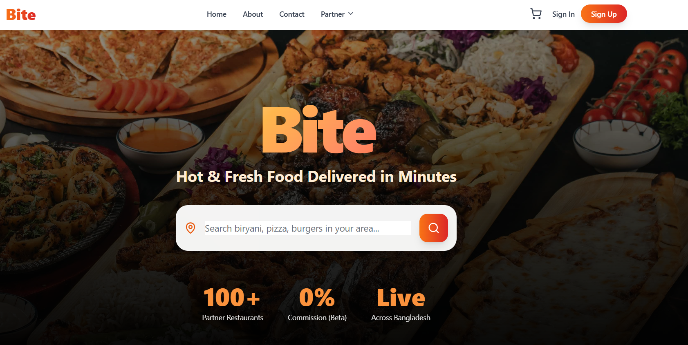
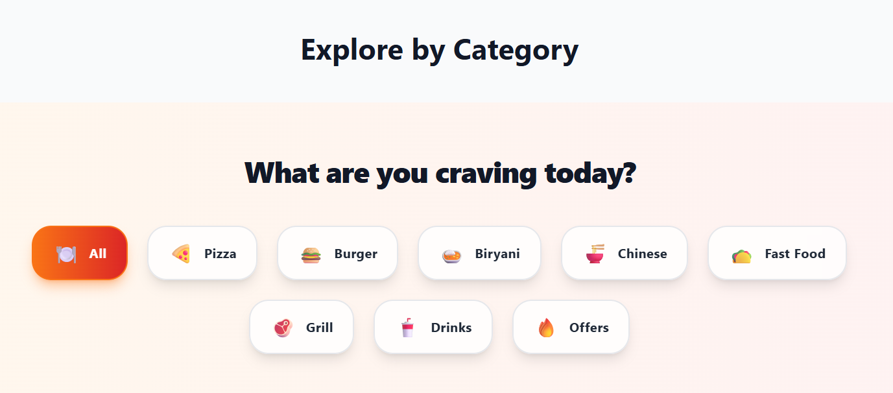
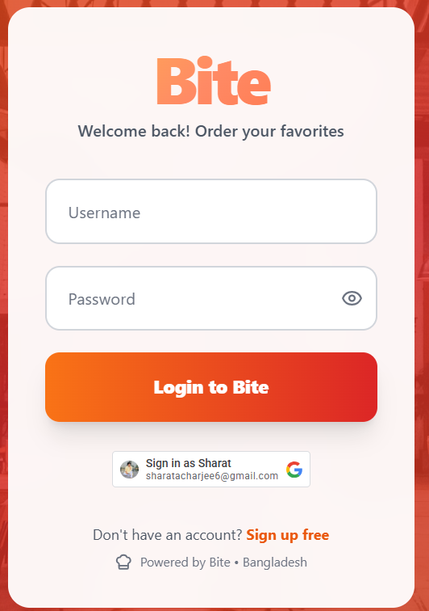
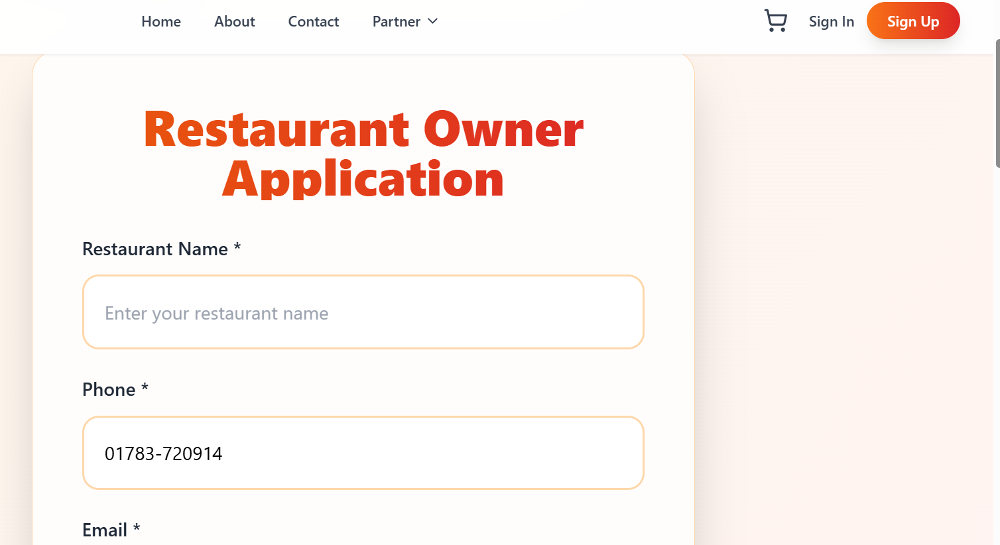
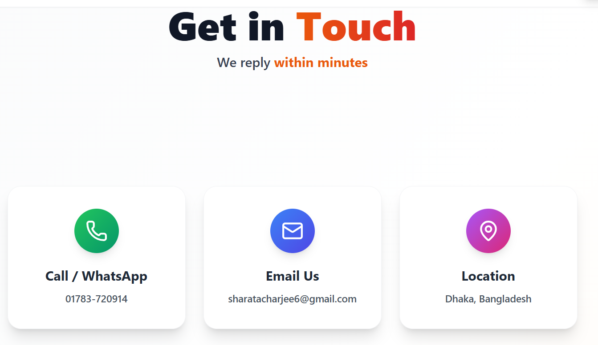

# 🍔 Bite – Full-Stack Food Delivery Platform

Modern, scalable food delivery system tailored for the Bangladesh market.

**Frontend Live** → https://food-delivery-frontend-mktt.onrender.com  
**Backend API**   → https://food-delivery-app-1-ihcm.onrender.com


*Clean, mobile-first interface built for fast food discovery & ordering*

---

## 🌟 Project Highlights

Bite connects hungry customers with local restaurants through a production-grade full-stack application.

Key capabilities:

- Seamless customer ordering experience
- Restaurant partner onboarding & menu management
- Secure JWT-based authentication
- Real-time cart & order calculations
- RESTful API architecture
- Ready for cloud deployment (Render + Cloudinary)

Demonstrates clean separation of concerns, modern frontend tooling and production-ready backend practices.

---

## 📸 Screenshots

| Section                  | Preview                              |
|--------------------------|--------------------------------------|
| **Landing Page**         |    |
| **Categories & Filters** |       |
| **Login / Auth**         |          |
| **Become a Partner**     |         |
| **Contact Section**      |         |

---

## ✨ Features

### 👤 Customer Experience
- Browse restaurants by category & cuisine
- Real-time cart with dynamic pricing & quantity controls
- Secure login/signup with **JWT**
- Order placement & history view
- Fully responsive — mobile-first design

### 🏪 Restaurant Partner Dashboard
- Easy restaurant registration flow
- Menu & item management (extendable)
- View and manage incoming orders
- Zero-commission beta model support

### 🔐 Security & Foundation
- JWT token authentication
- Role-based access (customer / restaurant / future: delivery)
- Input validation & proper error handling

---

## 🛠 Tech Stack

| Layer          | Technology                          | Purpose / Notes                              |
|----------------|-------------------------------------|----------------------------------------------|
| **Frontend**   | React 18 • Vite                     | Fast development & build tool                |
| **Styling**    | Tailwind CSS                        | Utility-first, highly customizable           |
| **HTTP Client**| Axios                               | API communication                            |
| **Icons**      | Lucide React                        | Clean, modern icon set                       |
| **Backend**    | Django 5+ • Django REST Framework   | Robust API & ORM                             |
| **Auth**       | djangorestframework-simplejwt       | Secure token-based auth                      |
| **Database**   | PostgreSQL (prod) • SQLite (dev)    | Reliable & easy local setup                  |
| **Media**      | Cloudinary                          | Image upload & optimization                  |
| **Deployment** | Render                              | Frontend + Backend + Gunicorn                |

---

## 🚀 Quick Start (Local Development)

### Backend

```bash
git clone https://github.com/Sharatpsd/Food-Delivery-App-.git
cd Food-Delivery-App-/backend

# Create virtual environment
python -m venv venv
source venv/bin/activate    # Linux/macOS
# or venv\Scripts\activate   # Windows

pip install -r requirements.txt

# Apply migrations & start server
python manage.py migrate
python manage.py runserver
