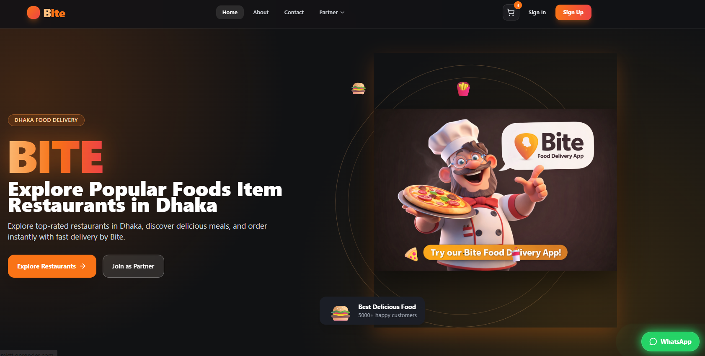
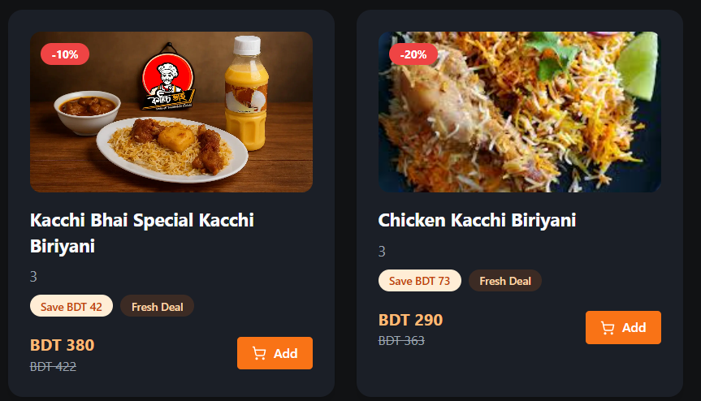
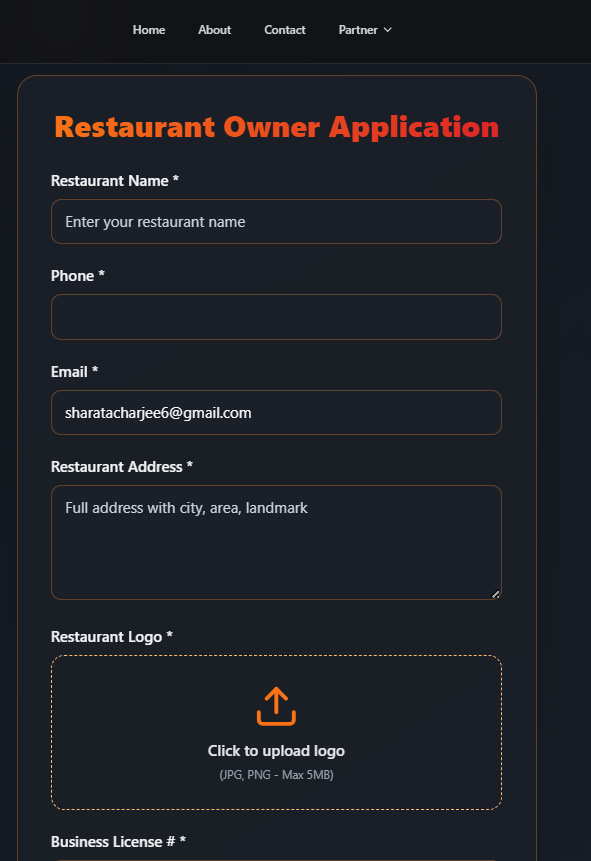

# 🍔 Bite – Full Stack Food Delivery Platform

Modern **Food Delivery Web Application** built to simulate a real-world food delivery system like **Foodpanda or Uber Eats**, tailored for the Bangladesh market.

This project showcases **full-stack architecture**, **REST API design**, **JWT authentication**, **cart & checkout logic**, and **restaurant onboarding system**.

[](https://food-delivery-frontend-mktt.onrender.com)
[](https://food-delivery-app-1-ihcm.onrender.com)
[](LICENSE)

---

# 🚀 Live Project

🌐 **Frontend Live:**  
https://food-delivery-frontend-mktt.onrender.com  

⚙ **Backend API:**  
https://food-delivery-app-1-ihcm.onrender.com  

💻 **GitHub Repository:**  
https://github.com/Sharatpsd/Food-Delivery-App-

---

# 📸 Project Screenshots

| | | |
|---|---|---|
|  |  |  |
|  |  |  |
|  |  |  |
 |  |  

---

# 🌟 Project Overview

**Bite** is a modern **food delivery platform prototype** designed to simulate the workflow of real-world delivery platforms.

The system allows users to browse restaurants, explore menus, add food to cart, and complete a checkout process.

Restaurant owners can also apply to become partners through a dedicated onboarding system.

The architecture follows a **clean separation between frontend and backend**, making the platform scalable and maintainable.

---

# ✨ Core Features

### 👤 Customer Features

- User Registration & Login
- Google Authentication Integration
- Browse Restaurants
- Dynamic Menu Browsing
- Add to Cart Functionality
- Quantity Control (+ / −)
- Real-time Price Calculation
- Multi-Step Checkout System
- Order Summary Page
- Fully Responsive UI

---

### 🏪 Restaurant Partner System

Restaurant owners can apply to join the platform by submitting:

- Restaurant Name
- Phone Number
- Email Address
- Restaurant Address
- Restaurant Logo
- Business License

This simulates the **restaurant onboarding workflow used by real delivery platforms**.

---

### 🔐 Security

- JWT Token Authentication
- Secure Password Hashing
- Google OAuth Login
- Input Validation

---

# 🛠 Tech Stack

### Frontend

- React
- Vite
- Tailwind CSS
- Axios
- Lucide React Icons

Purpose:  
Fast and modern UI with responsive design.

---

### Backend

- Django
- Django REST Framework
- JWT Authentication

Purpose:  
Secure REST API architecture.

---

### Database

- PostgreSQL (Production)
- SQLite (Development)

---

### Media Management

- Cloudinary

Used for:

- Image upload
- Restaurant logos
- Media optimization

---

### Deployment

- Render (Frontend + Backend hosting)

---

# ⚙ Local Development Setup

### Clone Repository

```bash
git clone https://github.com/Sharatpsd/Food-Delivery-App-.git
cd Food-Delivery-App-
